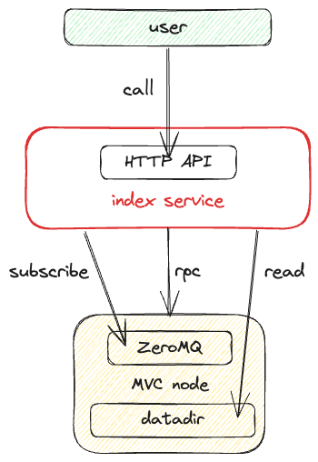

# How to Deploy the Index Service (Simple)

The index service is built on top of the MVC node.



Before deploying, make sure the node software runs correctly with the following configurations enabled.

```dotenv
rest=1
txindex=1
zmqpubrawtx=tcp://0.0.0.0:19000
zmqpubhashtx=tcp://0.0.0.0:19000
```

## System requirements

We recommend that you use a machine with **4 cores** and **16G of memory** at least to run the indexing service.

## Step 1. Create .env file

```dotenv
#
# !!! change the following configs according to your situation
#
# node rpc
RPC_HOST=0.0.0.0
RPC_PORT=9882
RPC_USER=ubuntu
RPC_PASSWORD=rpcpassword
# node zmq
ZMQ_SERVER=tcp://0.0.0.0:19000
# mysql
DATABASE_HOST=0.0.0.0
DATABASE_PORT=3306
DATABASE_DB=mvc_mainnet
DATABASE_USERNAME=root
DATABASE_PASSWORD=password
#
# !!! copy the following configs directly without any changes
#
DATABASE_TYPE=mysql
BLOCK_CACHE_FOLDER=./blocks
BLOCK_CACHE_NUMBER=500
BLOCK_DOWNLOAD_MS=2000
BLOCK_PROCESS_MS=10
BLOCK_TIME_MS=10
TX_PROCESS_MS=1
PORT=15000
# save path of config file
CONFIG_FILE=/data/.block_parse.json
# save path of block index
DB_LEVEL_INDEXER_PATH=/data/transport_indexer
# save path of mempool tx index
DB_LEVEL_MEMPOOL_PATH=/data/transport_mempool
# mapped path of node datadir
NODE_DATA_PATH=/node/.mvc
```

## Step 2. Create docker compose file

```yaml
version: '3'
services:
  mvc-assets-indexer:
    image: ghcr.io/mvc-labs/mvc-assets-indexer:v1.4.2
    restart: always
    ports:
      - "15000:15000"
    env_file:
      - .env
    environment:
      - RPC_EXT_HOST=mvc-node-extend
      - RPC_EXT_PORT=8000
    volumes:
      - './data:/data'
  mvc-node-extend:
    image: ghcr.io/mvc-labs/mvc-node-extend:v1.0
    restart: always
    ports:
      - "8000:8000"
    env_file:
      - .env
    volumes:
      - './data:/data'
      #
      # !!! change `/home/ubuntu/.mvc` to your node datadir
      #
      - '/home/ubuntu/.mvc:/node/.mvc'
```

## Step 3. Start service

```bash
docker compose up -d
```
